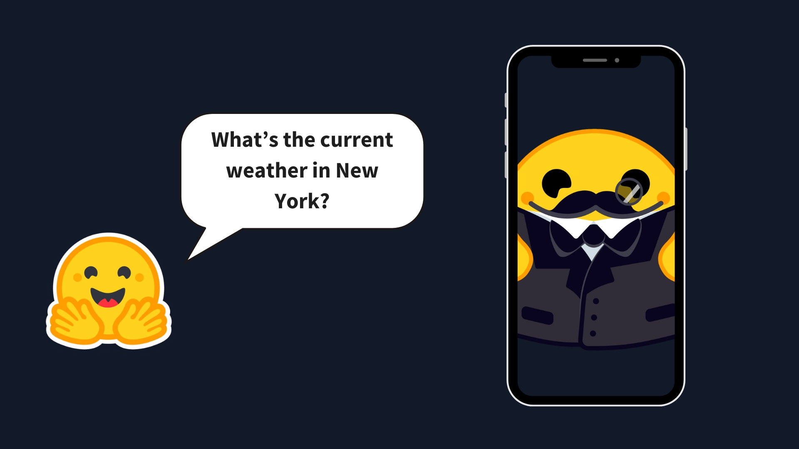
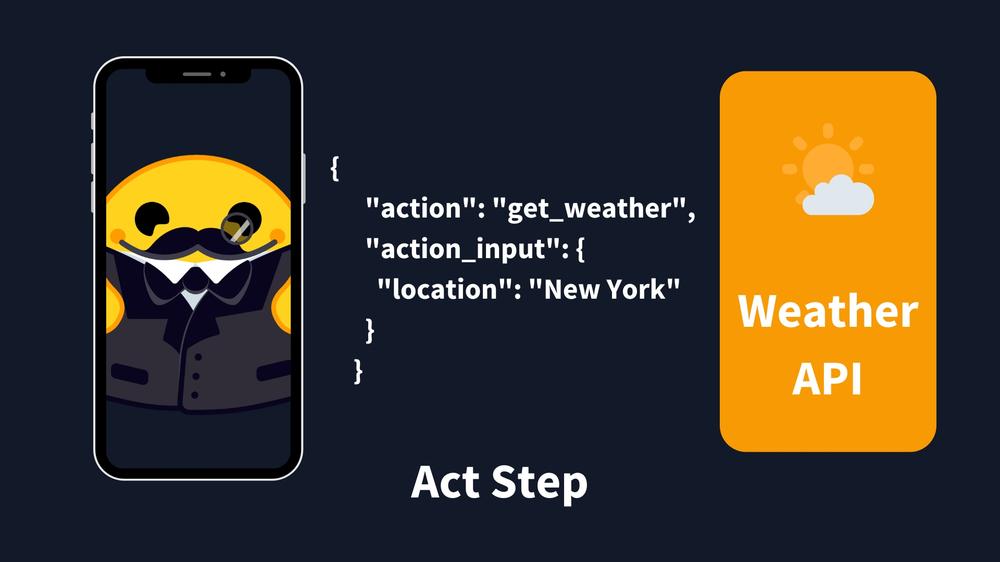
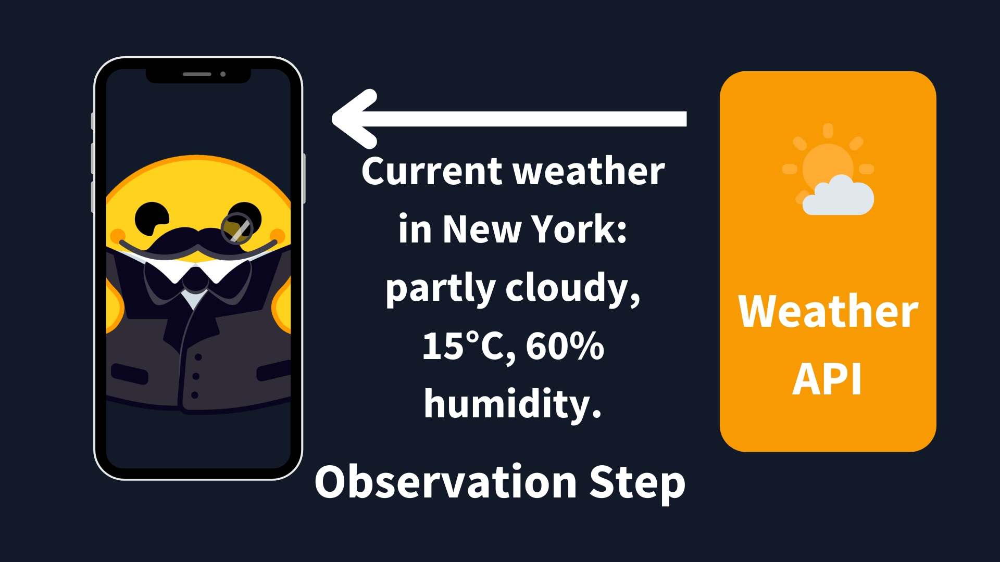

# How Agents Think
### Types, Behaviors & Design Patterns

[**Hamza Farooq**](https://github.com/hamzafarooq) and [**Jaya Rajwani**](https://github.com/JayaRajwani)

## **Welcome to Day 2 of the 7-Day Agents in Action Series.**

Hi!

My name is [Hamza](https://www.linkedin.com/in/hamzafarooq/), and I am so excited to welcome you to our new course. Joining me is [Jaya](https://www.linkedin.com/in/jayarajwani/) who is a ninja in Agents!

In these 7 sessions we will uncover all we can about Agents, what they are, how they work and the what’s really behind all this hype?

In Day 1 of the course [Agents are here and they are staying](link), we explored what makes agents different from GenAI chatbots. We saw how vertical agents are domain-specific, tool-using, and memory-augmented digital workers. One critical layer to add to this recipe of vertical agents is: **how do agents actually think?**

Not from a philosophic standpoint but from an architectural standpoint.

When you give an agent a task, for example: "write a report," "search for a policy," "check this document for compliance", how does it decide what to do first? Does it jump in? Does it stop and plan? Does it revise if something goes wrong?

`***"Most agents don’t fail because they lack intelligence. They fail because they don’t know how to think.”***`

  <em><a href="https://aiablog.medium.com/new-thinking-method-for-agents-better-than-reasoning-models-fbd71ae77464">New Thinking Method for Agents | Better than reasoning models</a></em>

That, right there, is where most GenAI builders hit their ceiling. Because you can bolt memory and tools onto an LLM, but if the agent doesn’t have a thinking loop, it breaks down after step one. This is where Agent Thinking Styles come into play.

## **How Agents Think: A Practical Viewpoint**
Let’s start simple. Imagine asking your agent:

`"Summarize this PDF."`

A reactive agent would instantly extract the text, summarize it, and return an answer. No memory. No context. No second thoughts. Done.

Now imagine you ask:

`"Scan these ten compliance policies and alert me to any mismatches with our internal rules."`

That’s not a one-shot task. Now the agent has to:
- Break the request into steps
- Retrieve internal guidelines
- Compare across multiple documents
- Identify inconsistencies
- Possibly ask clarifying questions

This is no longer about reacting. This is thought, action, and observation cycle. And that’s the key takeaway here: agents don’t just differ in what they do - they differ in how they think. This is also sometimes called the agent loop. These components of the loop work as:
1. **Thought**: The LLM part of the Agent decides what the next step should be.
2. **Action**: The agent takes an action, by calling the tools with the associated arguments.
3. **Observation**: The model reflects on the response from the tool.

|  |  |
|-----------------------------|-----------------------------|
|      |  |
