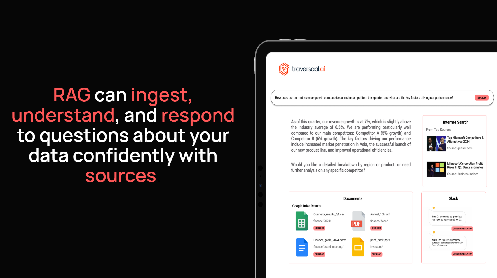
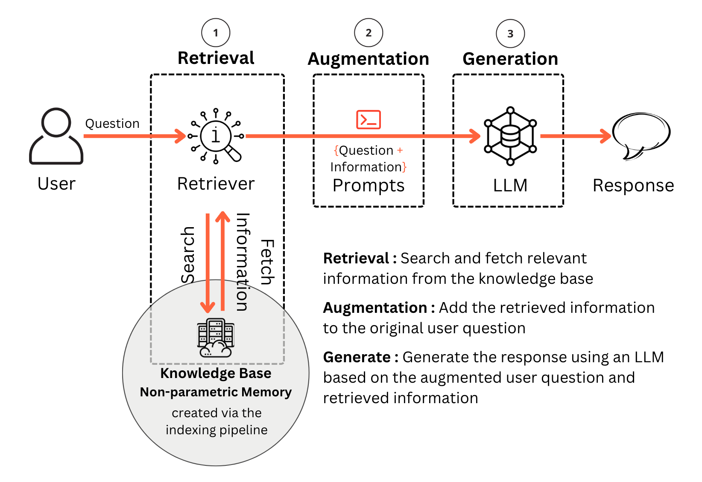

# Day 4: Agentic RAG Ecosystem
### Powering Agents with Real-World Knowledge

[**Hamza Farooq**](https://github.com/hamzafarooq) and [**Jaya Rajwani**](https://github.com/JayaRajwani)

## Welcome to Day 4 of the 7-Day Agents in Action Series.

Hi!

My name is [Hamza](https://www.linkedin.com/in/hamzafarooq/), and I am so excited to welcome you our new course. Joining me is [Jaya](https://www.linkedin.com/in/jayarajwani/), who is a ninja in Agents!

In these 7 sessions we will uncover all we can about Agents, what they are, how they work and the what’s really behind all this hype?

In the first three days, we moved from big picture to architecture.

[Day 1](link) clarified what sets agents apart from GenAI,

[Day 2](link) dug into how agents think and

[Day 3](link) explored memory and how agents remember.

Together, these layers lay the foundation for what comes next: **retrieval-augmented generation**, or RAG - the key to making agents both smart and informed.

Large Language Models (LLMs) are powerful, but they come with a major limitation: their knowledge is frozen in time. Once trained, they can’t access new information unless retrained. That’s where Retrieval-Augmented Generation (RAG) comes in.

RAG allows LLMs to access external sources of truth in real-time. Instead of guessing or hallucinating answers, RAG-powered agents can "look things up" before responding. This makes them ideal for high-stakes applications like healthcare, finance, legal, and customer support.

``***"Knowledge isn’t static an so shouldn’t be your AI”***

  <em>Source: <a href="https://neo4j.com/blog/developer/knowledge-graph-llm-multi-hop-reasoning/">Knowledge Graphs & LLMs: Multi-Hop Question Answering</a></em>

# **BUT!!!! WHAT IS RAG??**

Retrieval-Augmented Generation is an AI architecture that combines retrieval systems with generative models. The retrieval system fetches relevant documents or facts from a knowledge base, and the language model uses that context to generate an informed response.

This architecture stands in contrast to the so-called "closed-book" LLMs that rely only on what they were trained on. With RAG, we get "open-book" models that can dynamically access knowledge.

  <em>Source: <a href="https://towardsdatascience.com/beyond-naive-rag-advanced-techniques-for-building-smarter-and-reliable-ai-systems-c4fbcf8718b8/">Beyond Naive RAG: Advanced Techniques for Building Smarter and Reliable AI Systems</a></em>

**Example**: Instead of asking a model to summarize GDPR from memory, a RAG system retrieves the actual GDPR document and generates the summary from it.

To understand RAG in depth, let’s cover the core components of RAG.

## **Core Components of a RAG System**

**1. Retriever:**

The retriever component is responsible for identifying and returning relevant context from a large corpus of documents. It typically consists of:

- Embedding Model: Converts queries and documents into dense vector representations using pretrained models like **BERT** [[Devlin et al., 2018](https://arxiv.org/abs/1810.04805)], **MiniLM** [[Wang et al., 2020](https://arxiv.org/abs/2002.10957)], or domain-specific models like **SciBERT** [[Beltagy et al., 2019](https://arxiv.org/abs/1903.10676)].
- Vector Index: These vectors are stored in a specialized vector index such as FAISS (Facebook AI Similarity Search) [Johnson et al., 2017] for efficient retrieval.
- Similarity Search: Matches query embeddings against stored vectors using distance metrics like cosine similarity or L2 (Euclidean) distance. Approximate Nearest Neighbor (ANN) algorithms like HNSW [Malkov & Yashunin, 2018] are used to retrieve millions of documents.
