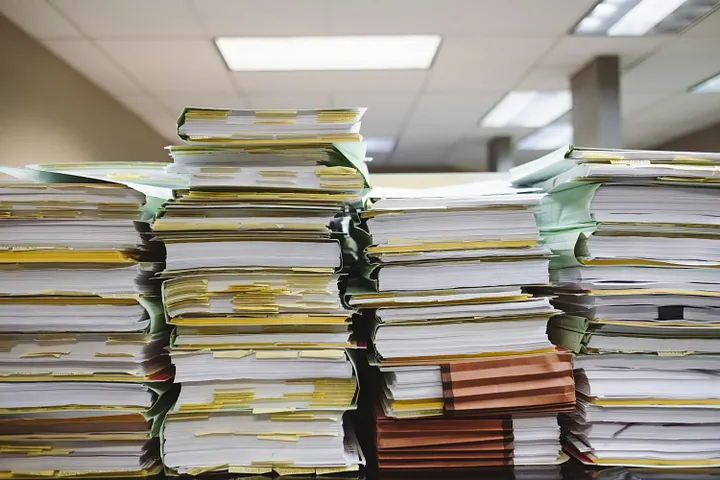

# Day 5: Multimodal Agents
### Going Beyond Text

[**Hamza Farooq**](https://github.com/hamzafarooq) and [**Jaya Rajwani**](https://github.com/JayaRajwani)

## Welcome to Day 5 of the 7-Day Agents in Action Series.

My name is [Hamza](https://www.linkedin.com/in/hamzafarooq/) and I’m excited to welcome you back to *Agents in Action*. As always, I’m joined by [Jaya](https://www.linkedin.com/in/jayarajwani/), who’s been breaking down how vertical agents actually work. For today’s edition, we are joined by [Areej Mehboob](https://www.linkedin.com/in/areej-mehboob-396b7a207/), a brilliant AI engineer and researcher helping us unpack the world of multimodal agents.

In these 7 sessions we will uncover all we can about Agents, what they are, how they work and the what’s really behind all this hype?

Read: [Day 1](link)

Read: [Day 2](link)

Read: [Day 3](link)

In [Day 4 RAG – Powering Agents with Real-World Knowledge](link), we discussed how retrieval lets agents access external knowledge from databases, APIs, or document stores, making them more grounded and flexible. Retrieval-Augmented Generation (RAG) systems and multimodal large language models (LLMs) are evolving rapidly, finding applications in everything from enhancing search experiences to generating complex content. These methods are constantly being refined to expand the boundaries of what AI can achieve.

But what happens when that knowledge isn’t in plain text?

  <em>Photo by <a href="https://unsplash.com/@wesleyphotography?utm_source=medium&utm_medium=referral">Wesley Tingey</a> on <a href="https://unsplash.com/?utm_source=medium&utm_medium=referral">Unsplash</a></em>

What if you could combine their strengths to build a RAG system that not only handles text but also processes images, tables or other visual information seamlessly?

Now imagine taking it a step further by creating this system without relying on pre-built frameworks such as LangChain or LlamaIndex?

This post explores how to architect a multimodal RAG system from scratch — built to ingest, embed, and retrieve both text and images. No wrappers, no dependencies, just full control.

  <em>Process Flow for Multi-Modal RAG Pipeline</em>

# **What is a Multimodal RAG System?**
A Multimodal RAG system combines traditional retrieval-augmented generation with the ability to handle visual data alongside text. Instead of relying solely on documents and APIs, it can process PDFs, extract tables, interpret diagrams, and reason across formats.

## **Why This Matters**:
Text is just one part of most real-world documents. From technical drawings to scanned reports, image data plays a critical role. A multimodal agent expands the usefulness of your LLM by allowing it to make sense of diverse formats.

## **Example Use Cases**:
- Disaster reports with maps and stats
- Legal or medical records with annotated images
- Environmental data with satellite imagery
