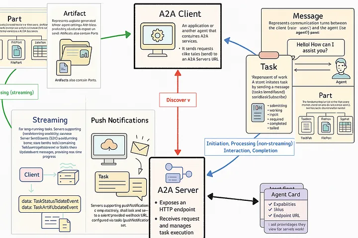
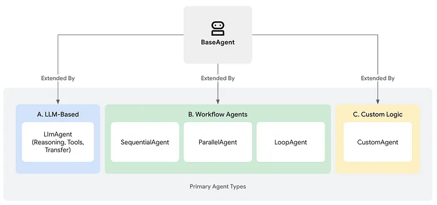

# Day 6: Scaling Agents: Architectures with Google ADK, A2A, and MCP
### Do you think you know MCP?

[**Hamza Farooq**](https://github.com/hamzafarooq) and [**Jaya Rajwani**](https://github.com/JayaRajwani)

## Welcome to Day 6 of the 7-Day Agents in Action Series.

Hi again!

I’m [Hamza](https://www.linkedin.com/in/hamzafarooq/), joined once again by [Jaya](https://www.linkedin.com/in/jayarajwani/) — and today, we’re stepping into the build phase.

If you like this series, we’d love you to have you in our course for AI Agents for Enterprise course on [Maven](https://maven.com/boring-bot/ml-system-design) and be a part of something bigger and join hundreds of builders to develop enterprise level agents.

Now back to the course:

Over the last five days, we’ve set the foundation. We explored how agents evolved from GenAI ([Day 1](link)), how they think and reason ([Day 2](link)), how they remember through different types of memory ([Day 3](link)), how they access real-time knowledge via retrieval ([Day 4](link)), and how they extend their intelligence beyond text through multimodality ([Day 5](link)).

But agents don’t live in isolation. In the real world, they need to talk to other agents, access external tools, and operate safely at scale.

  <em>Source: <a href="https://medium.com/fundamentals-of-artificial-intellegence/agent-to-agent-a2a-protocol-e001d480b41c">Agent Communication example</a></em>

In this article, we will explore how Google is shaping this with its Agent Development Kit (ADK), the Agent-to-Agent (A2A) protocol, and the Model Communication Protocol (MCP). These are not just tools - they represent a shift in how agents are designed, orchestrated, and deployed in real-world systems.

We will also unpack how these components work together to build scalable, modular, and secure agentic infrastructure.

# **Building Agents with Google Agent development kit (ADK)**

  <em>Source: <a href="https://google.github.io/adk-docs/">Google Agent Development Kit</a></em>

Let’s start with the question behind every serious AI project:

How do we go from a clever demo to a reliable, reusable agent?

Because here’s the truth: most GenAI agents today are just dressed-up prompts. They might look smart in a single interaction, but they break down quickly when you need structure, memory, collaboration, or consistency.

That’s where Google’s Agent Development Kit (ADK) comes in, a production-grade framework built to help you move beyond hacks and experiments. ADK gives you the building blocks to create agents that can plan, act, and scale — not just respond.

At its core is the BaseAgent class - a flexible template you can extend to define how your agent reasons, remembers, and decides what to do next. But ADK goes much further: it supports tool use, multi-agent coordination, streaming, memory modules, and evaluation, all with a developer experience that’s actually pleasant.

  <em>Source: <a href="https://google.github.io/adk-docs/agents/">https://google.github.io/adk-docs/agents/</a></em>

Think of ADK as your workbench for real-world agent systems.

Not just one chatbot. Not just one clever workflow. A foundation for building intelligent systems that can collaborate, adapt, and operate with guardrails in place.
