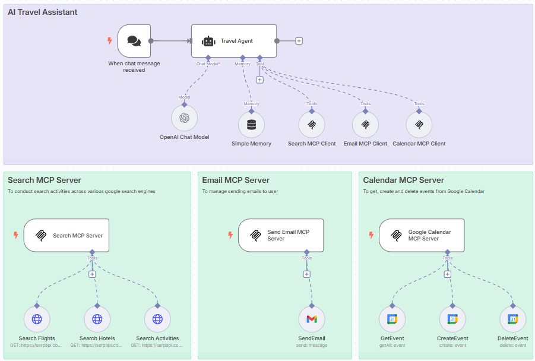

# Day 7: Fully Functional Agent Loop
### Build a Fully Functional ReAct Travel Agent using n8n

[**Hamza Farooq**](https://github.com/hamzafarooq) and [**Jaya Rajwani**](https://github.com/JayaRajwani)

## Welcome to Day 7 of the 7-Day Agents in Action Series.

Hi again!

It’s [Hamza](https://www.linkedin.com/in/hamzafarooq/) and [Jaya](https://www.linkedin.com/in/jayarajwani/), and you’ve officially made it to the final day of our 7-part journey into the world of intelligent agents.

If you’ve followed along since [Day 1](link), you now understand how agents think, plan, retrieve, and interact. Here’s a quick recap of what we've covered:

[Day 1: Agents are here and they are staying](link)

We explored the rise of agents from basic GenAI capabilities to autonomous systems. Why just prompt a model when you can give it goals?

[Day 2: How agents think](link)

We dug into planning and reasoning: how agents break tasks into subtasks, choose actions, and reason step-by-step.

[Day 3: Memory - the agent's brain](link)

We covered short-term and long-term memory, vector stores, and how agents remember and reflect across tasks.

[Day 4: Agentic RAG Ecosystem](link)

We explored Retrieval-Augmented Generation (RAG) for agents to access real-time knowledge through document and database search.

[Day 5: Multimodal agents](link)

We saw how agents can go beyond text — interpreting images, audio, PDFs, and more.

[Day 6: Scaling agents with ADK, A2A, and MCP](link)

We explored how Google’s ADK, A2A protocol, and MCP create scalable agentic infrastructure. From single-agent demos to real-world deployable systems.

For this finale, we’re going from theory to reality: building a working travel agent using only the concepts and tools we covered over the past week.

