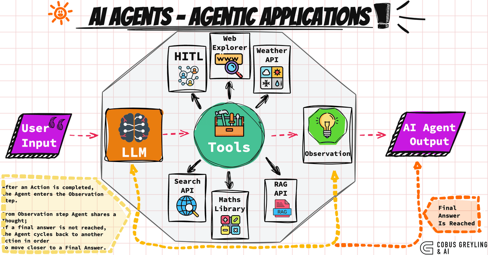
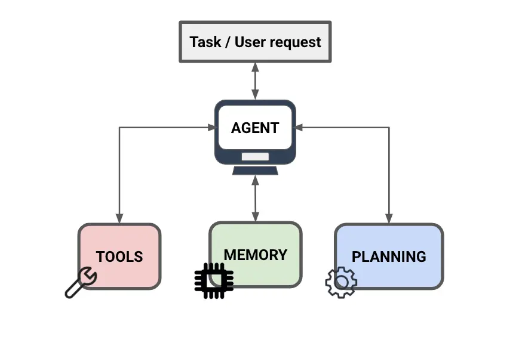
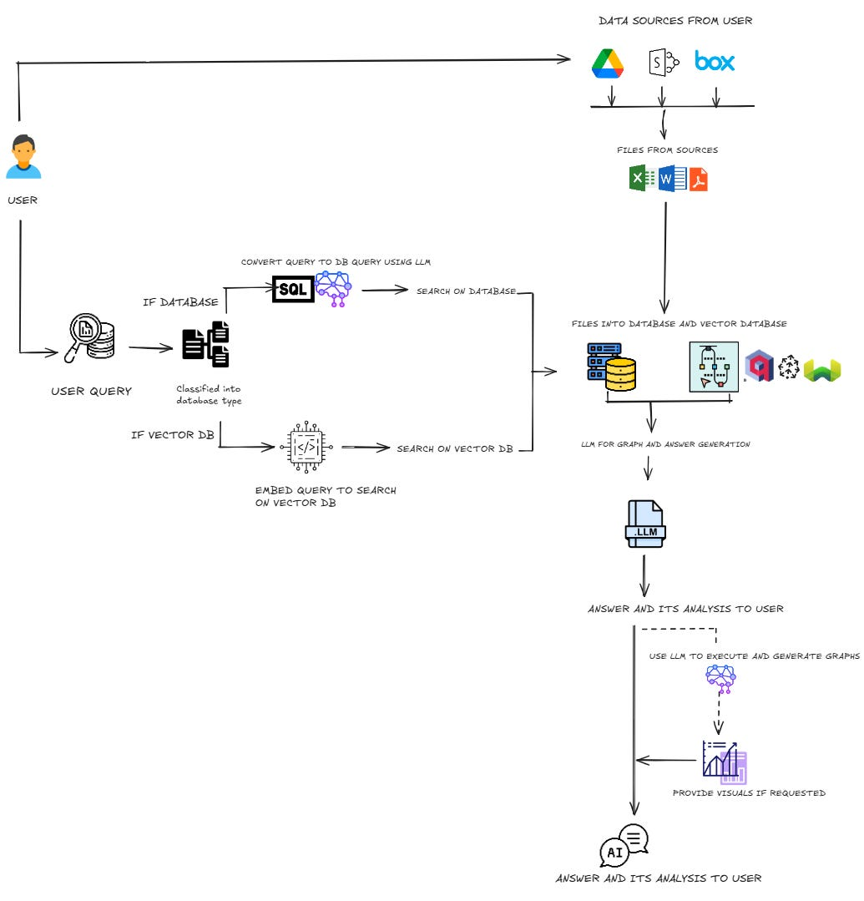
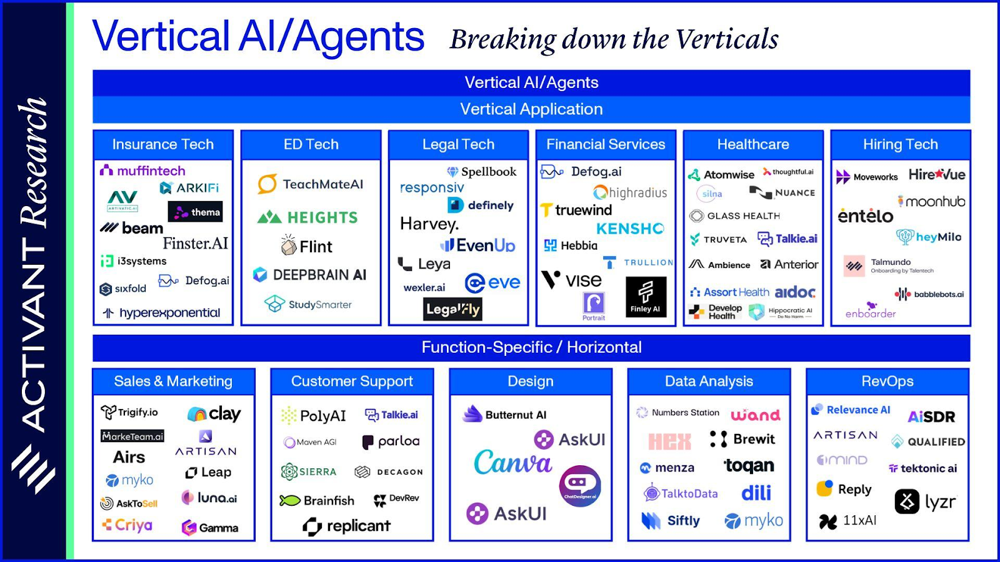

# Agents are here and they are staying
### A Shift from Answers to Actions

## **The Advent of Agents**

  <em>Agents are LLMs with access to fancy tools!</em>

If I had to choose one word to describe the experience of the internet these days, it would be “surreal”. The past year has been a blur of LLM demos, ChatGPT wrappers, and fancy UIs trying to make GenAI feel useful. But under the surface, something much deeper is shifting.

We’re not just building better models. We’re building entirely new kinds of software: systems that can think, remember, and act. We’re entering the era of AI agents

The idea of developing AI agents has become both a necessity and a buzz in 2025. Every person I turn to says the future is Agentic. But what is Agentic? What are Agents in fact? Let’s talk about the evolution of Agents first.

### **Generative AI vs Agents - A Real Difference**
Let me be honest: Gen AI was fun at first. GPT-3 was like having a clever parrot in your pocket. Ask it to write a haiku about Kubernetes? Boom. Done. Summarize an article? Easy. But after the novelty wore off, most people hit the same wall: it talks well, but it doesn’t do much.

The first step beyond pure text was RAG — letting models retrieve real-world knowledge. Then we added images, tables, and code execution and started building multi-modal systems. What went wrong with that? Context-awareness, memory, performing tasks, etc., are some things RAGs cannot handle.

So we started layering memory, planning, and reflection into the loop. That’s the recipe for agents.

#### **What are agents?**

***An artificial intelligence agent is a software program that can interact with its environment, collect data, and use the data to perform self-determined tasks to meet predetermined goals.***

We’re not prompting anymore. We’re assigning work.

 

  <em>We all know who wrote that email</em>

In simple words, Agents = LLMs with access to tools and memory, tasked with planning and executing goals.

“Unlike LLMs, Today’s AI agents are an engineering innovation, not an AI innovation”

  <em><a href="https://www.promptingguide.ai/agents/introduction">Source: Introduction to AI Agents | Prompt Engineering Guide</a></em>

## **Agent Components: What Makes Them Work**
Let’s move from concept to construction. What actually goes into building an agent that does more than just chat?

Think of an agent like a digital worker. Just like a person needs tools, memory, and goals to be useful, so does an agent. Here are the core components that make it tick:

## **1. LLM Core**
The engine behind the brain. This is your GPT, Claude, or any transformer-based model doing the language-heavy lifting. It interprets tasks, formulates plans, and understands context.

## **2. Memory**
Agents need to remember what happened 5 minutes ago—and sometimes 5 days ago. You typically need:
- **Short-term memory**: For the current task or loop.
- **Long-term memory**: For storing facts, context, and historical insights.

## **3. Retrieval System (RAG)**
LLMs are forgetful by nature. Retrieval-Augmented Generation lets your agent look up knowledge on the fly—from internal documents, product manuals, databases, etc.

## **4. Tool Use**
Want your agent to book a meeting, run code, or send an email? It needs tools. Agents are most effective when they can:
- Call APIs
- Execute Python or SQL
- Write and read files
- Interact with user interfaces (browser agents, for example)

## **5. Planning & Control Loop**
Agents need a way to break big tasks into small ones, retry failed attempts, and update their plan as they go. This is often where techniques like ReAct or Plan-Act-Reflect come in (more on that in the next module).

These components aren’t nice-to-haves. They’re the foundation. If even one is missing, the agent will feel dumb, repetitive, or unreliable. When they all come together, something remarkable happens: the system feels intentional.

This changes everything. We’re not building linear flows. We’re architecting adaptive protocols.

## **Vertical Agents: Where the Magic Gets Real**
The core problem with many AI agents today is that they attempt to be too general-purpose. A single agent designed to do “everything” is unlikely to perform well in a structured enterprise workflow. Here are three major challenges:

1. **Ambiguity in Real-World Workflows** – Unlike controlled demo environments, business tasks involve ambiguous requirements, incomplete data, and nuanced decision-making.
2. **Lack of Integration with Enterprise Systems** – Most AI demos operate in isolation. In real enterprises, agents need to interact with databases, APIs, and knowledge management systems.
3. **Hallucination and Lack of Trust** – For AI agents to be adopted, they must be reliable. A one-off success in a demo is irrelevant if the agent can’t consistently perform well on enterprise-grade tasks.

Instead of building broad, generalist agents, we should focus on Vertical Agents - highly specialized AI workers optimized for domain-specific tasks.

These agents don’t try to be all-knowing; instead, they are fine-tuned to handle structured workflows with precision, accuracy, and repeatability.

You don’t need an agent that does everything. You need one that knows your world. That’s what makes vertical agents so powerful.

***Vertical agents aren’t just AI. They’re domain-specific digital workers.***

These agents are trained and designed to work within a narrow context - say, finance, healthcare, compliance, or ops. They are not jack of all trades but within their domain they can outperform general-purpose models by a mile.

Let’s take a real-world view of vertical agents:

1. A compliance agent that reads contracts, flags risk, and drafts corrections.
2. A healthcare agent that updates charts, recommends follow-ups, and ensures HIPAA compliance.
3. A sales agent that knows your CRM schema, tracks conversions, and drafts custom follow-up emails.

These aren’t fancy chatbots. They are autonomous systems with purpose. Think of them as interns who don’t sleep, don’t forget, and don’t need onboarding.

According to AIM Research, vertical AI startups could be 10x in value by 2030. This isn’t hype. It’s gravity.

Companies adopting vertical agents are reporting 2–5x productivity boosts. Some are cutting operational overhead by 80% just by automating the right 20% of tasks. This isn’t software anymore. It’s a workforce.

## **The Data Analyst Agent — A Glimpse of What’s Coming**

  <em>Your RAG Powered Data Analyst</em>

Businesses often struggle with extracting insights from large datasets. A human analyst can take hours or days to clean data, run queries, and generate reports. A well-designed Data Analyst Agent can automate and augment this process, working alongside humans to accelerate decision-making.

Here is the full-stack design of the Data Analyst Agent:

1. **Data Ingestion** – The agent integrates with databases (SQL, Snowflake, BigQuery) and ingests data for analysis.
2. **Preprocessing and Query Understanding** – Uses an LLM-powered query interpreter to translate natural language requests into structured SQL queries.
3. **RAG for Contextual Insights** – Retrieves relevant context (past reports, definitions) to generate more accurate insights.
4. **Guardrails and Verification** – Implements validation layers to ensure query accuracy and prevent hallucinations.
5. **Report Generation and Visualization** – Outputs clear, structured reports, either as text summaries or interactive dashboards.

Let’s go deeper on one example.

You ask:

# ***"Show me churn trends for enterprise customers in Q1."***

Here’s what your data analyst agent does:

1. Looks up the right database
2. Writes SQL based on your schema
3. Checks for gaps or anomalies
4. Plots a trend chart
5. Summarizes insights in plain English
6. Asks: "Want me to set an alert if this spikes again?"

It’s not just giving you an answer. It’s thinking like an analyst. That’s the real shift.

## **The Future of Software: SaaS Without the Screens**
SaaS isn’t going away. But the interface layer is.

Dashboards? Too slow. APIs? Too manual. Agents offer something simpler: outcomes.

You don’t need to go to your BI tool and run a query. You say:

**"Tell me how signups looked across EU vs US last week. Flag anything weird."**

The agent does it all:

- Interprets your intent
- Writes and runs SQL
- Builds a chart
- Writes a 3-line summary
- Sends it to Slack
   
No clicks. No configs. Just results.

That’s what we mean when we say "SaaS is dead."

## **Agents in the Wild: What’s Already Here**

Imagine a world, where we didn’t need to write code, introducing, the concept of vibe coding

At [Traversaal](https://traversaal.ai/), we don’t just talk about agents - we deploy them. Our AI data science agents help teams make real-time, reliable, insight-driven decisions.

The key takeaway? The most impactful AI agents aren’t the ones that can do everything, but the ones that can do one thing exceptionally well.

We cut through the noise of flashy AI demos and focus on what truly matters—building practical, robust, and scalable AI agents that solve real business challenges.

Don’t forget to check out my **Agentic AI System Design for PMs** course on Maven if you are interested to be a part of something bigger.

