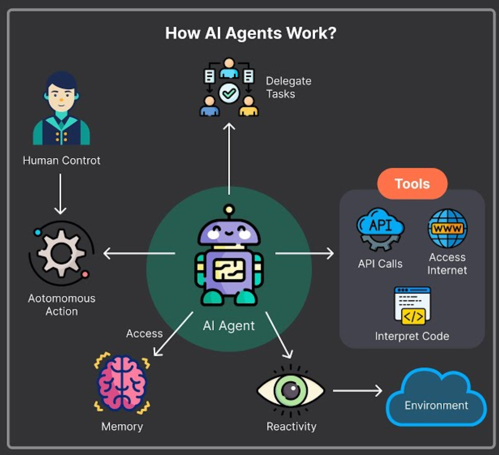

# Day 1: 🚀 Agents in Action: From LLMs to AI Agents
### The rise of Agents from mere LLMs!

[Hamza Farooq](https://github.com/hamzafarooq) and Bhavna Jain

Hi there!

My name is [Hamza](https://www.linkedin.com/in/hamzafarooq/), and I am so excited to welcome you to our transformative 10-day course on AI agents! Joining me throughout this journey is my cohort [Bhavna](https://www.linkedin.com/in/bhavna-s-jain/), our resident AI expert at [Traversaal.ai](https://traversaal.ai/)

In these 10 sessions, we'll uncover everything about AI agents—what they truly are, how they actually work, and what's really behind all this hype. We'll move beyond the buzzwords and build practical, enterprise-ready AI agents that can work alongside humans as genuine digital colleagues.

## 🎯 **What You'll Master Today**
By the end of today's lesson, you'll have a comprehensive understanding of:

- ✨ **LLM Fundamentals**: How large language models work and their limitations as standalone systems
- 🧠 **Agent Architecture**: The three core components that transform LLMs into agents
- 📈 **Maturity Levels**: The four stages of agent evolution and when to use each
- 🛠️ **Practical Applications**: Real-world examples of agents driving business value
- 🔄 **Planning Loops**: How agents think, act, and learn from their experiences
- 💡 **Strategic Thinking**: How to identify agent opportunities in your own work or organization

---

Over the past year, tools like ChatGPT have revolutionized how we interact with AI. They can generate text, answer complex questions, write code, and even engage in sophisticated conversations. But here's the thing, they're fundamentally reactive. They wait for us to prompt them, respond brilliantly, and then... wait again.

They're like having an incredibly knowledgeable consultant who only speaks when spoken to and forgets everything the moment the conversation ends.

**That's where AI agents change everything.**

## **🤖 What Exactly Is an AI Agent?**

At its core, an **AI agent is an LLM with access to tools**, but that simple definition understates a profound shift in capability. Think of it this way: if an LLM is like a brilliant scholar locked in a library with no phone, no internet, and no way to affect the outside world, then an AI agent is that same scholar given a smartphone, a credit card, access to APIs, and the ability to take actions in the real world.

But it's not just about tools. AI agents represent a fundamental evolution in how we think about AI systems. They transform passive responders into proactive digital workers that can:
- **Remember** conversations and context across time
- **Use tools** to interact with real-world systems, APIs, and databases
- **Plan and execute** multi-step workflows
- **Learn and adapt** from their actions and mistakes
- **Collaborate** with other agents and humans

The magic happens when we combine these capabilities. An LLM might tell you how to book a flight; an AI agent actually books it, adds it to your calendar, sends confirmations to relevant parties, and sets up reminders, all while remembering your preferences for future trips.

## 🧠 **The Three Pillars That Transform LLMs into Agents**

### **1. 🧠 Memory: The Foundation of Continuity**
Traditional LLMs reside in the eternal present; each conversation begins anew. AI agents, however, maintain different types of memory:

- **Conversational Memory**: Remembering what you discussed yesterday or last week
- **Procedural Memory**: Learning your preferences and workflows over time
- **Knowledge Memory**: Building and updating their understanding of your domain
- **Episodic Memory**: Recalling specific events and outcomes from past actions

