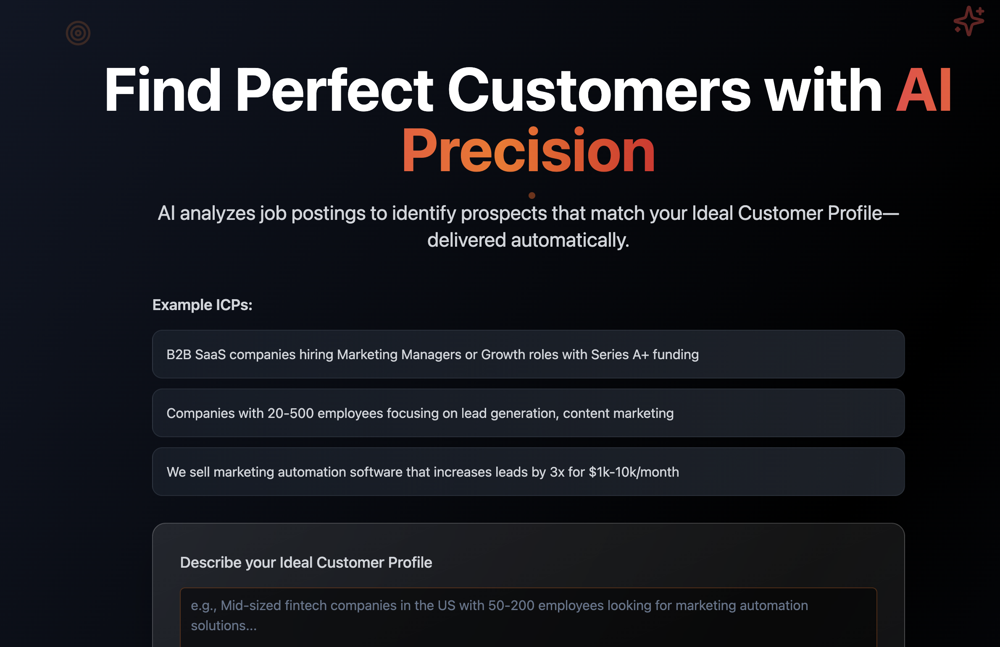
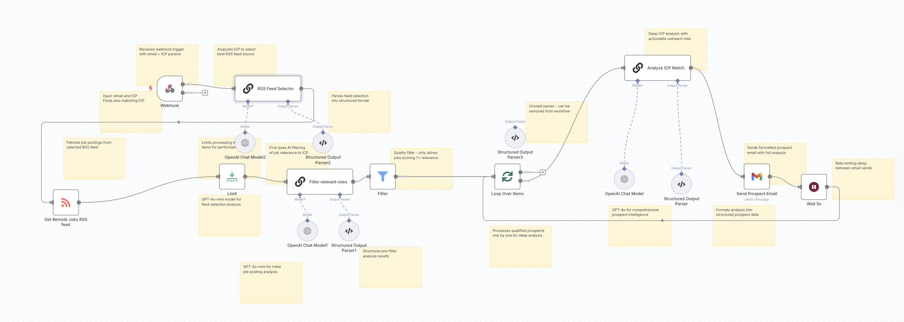

# Day 2: Building Your First AI Sales Agent
### Learn how to build an AI Agent that finds you the right customers for your product

[Hamza Farooq](https://github.com/hamzafarooq) and Bhavna Jain

Welcome back to Day 2 of our AI agents journey!

I'm [Hamza](https://www.linkedin.com/in/hamzafarooq/), and I'm thrilled to guide you from theory to practice today. Yesterday, we explored the fascinating world of AI agents and their four evolutionary levels. Today, we're rolling up our sleeves and building something real.

In today's session, we'll dive deep into **n8n**—the workflow automation platform that will become your secret weapon for creating Level 2 agents. By the end of this lesson, you'll have built and deployed your very first working sales prospect agent that can automatically research leads, qualify them, and populate your CRM.

This is an important tool, as we’ve used this very tool to help us land customers!

# **🎯 What You'll Master Today**

By the end of today's lesson, you'll have hands-on experience with:

- 🔧 n8n Fundamentals: Understanding the platform that powers thousands of automated workflows
- 🏗️ Workflow Architecture: How to design reliable, scalable agent workflows
- 🎣 Sales Prospecting: Building an agent that finds and qualifies leads automatically
- 🔗 API Integration: Connecting your agent to real-world systems like LinkedIn, CRMs, and databases
- 📊 Data Processing: Teaching your agent to analyze and score prospects
- 🚀 Deployment: Making your agent live and accessible

---

# **🤖 What Is n8n and Why It's Perfect for AI Agents**
**n8n** (pronounced "n-eight-n") is a powerful, open-source workflow automation platform that's become the go-to choice for building Level 2 AI agents. Think of it as the digital plumbing that connects different services, APIs, and tools into intelligent, automated workflows.

If you want a quick start for n8n, you can start with this video:

or this:

Here's what makes n8n special for AI agents:

## **Visual Workflow Design**
Instead of writing complex code, you build agents by connecting nodes visually. Each node represents an action, such as calling an API, processing data, making decisions, or triggering AI models. It's like creating a flowchart that actually executes.

## **500+ Integrations**
n8n connects to virtually every service you use: Salesforce, HubSpot, Google Workspace, Slack, LinkedIn, OpenAI, Anthropic, and hundreds more. This means your agents can interact with your entire tech stack.

## **AI-Native Features**
Built-in nodes for major AI providers, semantic similarity matching, intelligent data transformation, and natural language processing capabilities—all without writing a single line of code.

## **Scalable Architecture**
From simple automations to complex multi-agent systems, n8n scales with your needs. You can run it locally, in the cloud, or as part of enterprise infrastructure.

---

# **🎣 Why Start with a Sales Prospect Agent?**

See the website in [action](https://spark-lead-ignition-98.lovable.app/)

Sales prospecting is the perfect introduction to AI agents because it involves:

- **Data Collection**: Gathering information from multiple sources
- **Analysis**: Evaluating and scoring prospects based on criteria
- **Decision Making**: Determining which leads are worth pursuing
- **Action Taking**: Adding qualified prospects to your CRM
- **Continuous Learning**: Improving based on conversion feedback

This single use case touches every core component of Level 2 agents: tools, memory, and basic reasoning loops.

---

# **🏗️ The Architecture of Our Sales Prospect Agent**
Before we dive into building, let's understand what our agent will do based on this real-world implementation:

Here’s the [GitHub link](https://github.com/traversaal-ai/agents-in-action/blob/main/sales-porspects-agent/ICP_detailed_overview)

## **Step 1: Smart Feed Selection & Data Ingestion**

- **ICP-Based Feed Selection**: The agent analyzes your Ideal Customer Profile and intelligently selects the most relevant RSS feed from multiple sources (data science, marketing, finance, HR, or software development roles)
- **RSS Feed Monitoring**: Automatically pulls the latest job postings from remote job boards ([Remotive.com](https://remotive.com/) feeds)
- **Rate Limiting**: Processes jobs in controlled batches (10 at a time) to respect API limits and ensure quality analysis

## **Step 2: AI-Powered Pre-Filtering**

- **Initial ICP Screening**: Uses GPT-4o-mini to rapidly evaluate each job posting against your ICP criteria
- **Structured Data Extraction**: Extracts company details, tech stack, role level, company size estimates, and growth indicators
- **Relevance Scoring**: Assigns a 0-10 relevance score with detailed reasoning
- **Quality Gate**: Only jobs scoring 7+ proceed to detailed analysis (ensuring high-quality prospects)

## **Step 3: Deep Prospect Analysis & Intelligence**

- **Comprehensive Company Profiling**: GPT-4o performs detailed analysis of qualified prospects
- **ICP Match Validation**: Confirms alignment with your specific criteria and use cases
- **Pain Point Identification**: Analyzes job requirements to identify specific business challenges
- **Competitive Intelligence**: Assesses current tech stack and potential solution gaps
- **Urgency Assessment**: Determines priority level (High/Medium/Low) for outreach timing

## **Step 4: Personalized Outreach & CRM Integration**

- **Custom Email Generation**: Creates detailed prospect emails with company intelligence, talking points, and pitch strategies
- **Automated Delivery**: Sends formatted emails with all prospect details and recommended actions
- **Batch Processing**: Handles multiple prospects with built-in delays to avoid rate limits
- **Action Planning**: Provides specific next steps and timeline recommendations

---

# **🔧 Building Your Sales Prospect Agent: Technical Implementation**
## **The Workflow Breakdown**
### **1. Webhook Trigger**
Input: Email address + ICP description Purpose: Receives prospect requests and initiates the workflow

### **2. Feed Intelligence Selection**
*The agent analyzes your ICP and selects the optimal RSS feed:* Available feeds:

- Data Science/ML: [remotive.com/remote-jobs/feed/data](remotive.com/remote-jobs/feed/data)
- Marketing/Growth: [remotive.com/remote-jobs/feed/marketing](remotive.com/remote-jobs/feed/marketing)
- Finance/Legal: [remotive.com/remote-jobs/feed/finance-legal](remotive.com/remote-jobs/feed/finance-legal)
- HR/Recruiting: [remotive.com/remote-jobs/feed/hr](remotive.com/remote-jobs/feed/hr)
- Software Development: [remotive.com/remote-jobs/feed/software-dev](remotive.com/remote-jobs/feed/software-dev)

### **3. Job Processing Pipeline**
RSS Feed → Limit (10 jobs) → AI Pre-Filter → Quality Gate → Batch Processing → Deep Analysis → Email Generation

### **4. AI Analysis Schema**
The system extracts structured data including:

- Company intelligence (name, industry, size, stage)
- Technical requirements and stack
- Growth indicators and budget capacity
- ICP alignment scoring and reasoning
- Personalized outreach recommendations

---

# **📊 Real-World Example: Remote SaaS Tools Sales Agent**
Let me share how this actual workflow performs in practice:

**The Challenge**: A DevOps automation company needed to identify fast-growing startups hiring senior engineers who would need their CI/CD optimization tools.

**The ICP**: "Series A-C SaaS companies (50-200 employees) hiring senior/lead DevOps engineers, using cloud infrastructure (AWS/GCP), with indicators of scaling challenges (multiple environments, complex deployments, growing engineering teams)"

**The Solution**: Our n8n agent that:

1. **Analyzes ICP** and selects the software-dev RSS feed as optimal
2. **Monitors job postings** for senior DevOps, Site Reliability, and Platform Engineering roles
3. **Pre-filters using AI** to identify companies matching size and tech requirements
4. **Deep analysis** extracts specific pain points from job descriptions (scaling issues, deployment complexity, infrastructure management)
5. **Scores urgency** based on hiring velocity and technical requirements
6. **Generates personalized emails** with specific talking points about their infrastructure challenges

# **Results from 30-day test**

- 847 jobs processed, 73 qualified prospects identified (8.6% qualification rate)
- 41% email open rate (vs. 23% industry average)
- 18% response rate with personalized technical talking points
- 12 qualified sales conversations from automated outreach
- 3 deals in pipeline worth $47K ARR

## **Sample Generated Email Snippet:**
`🏢 TechFlow Analytics (Series B • 120 employees) 🎯 HIGH Priority ICP Match

Their Specific Needs: "Seeking Senior DevOps Engineer to manage multi-environment Kubernetes deployments, implement CI/CD automation, and scale infrastructure for 10x user growth..."

Why We're a Perfect Match: "Their job posting mentions 'deployment bottlenecks' and 'manual environment management' - exactly the challenges our platform eliminates for Series B companies..."

Key Talking Points:

- Reduce deployment time from 45min to 3min (based on their current K8s setup)
- Eliminate manual environment configuration errors
- Auto-scale infrastructure for their projected 10x growth`

See the website in [action](https://spark-lead-ignition-98.lovable.app/)

---

# **Common Pitfalls and How to Avoid Them**
## **Feed Selection Mistakes**
Don't assume you know which feed is best. Let the AI analyze your ICP - you might be surprised. A fintech ICP might find better prospects in the software-dev feed than finance-legal.

## **Over-Filtering Early**
The pre-filter should be permissive (score 7+ threshold works well). Too strict filtering eliminates good prospects that need human judgment.

## **Ignoring Batch Limits**
The workflow includes built-in delays and batching for good reason. Removing these will get you rate-limited or banned from APIs.

## **Generic ICP Descriptions**
Vague ICPs like "SaaS companies" produce poor results. Be specific: "Series A SaaS companies (20-100 employees) with customer-facing applications, hiring senior frontend engineers, showing signs of scaling challenges."

---

# **💡 Pro Tips for Success**
## **Optimize Your ICP Prompt**

Include specific indicators the AI should look for:

- Company size indicators (team mentions, funding stage)
- Technology stack requirements
- Growth signals (scaling language, hiring velocity)
- Budget capacity hints (role seniority, tech sophistication)

## **Monitor and Iterate**
Track which prospects convert to actual meetings/sales. Use this data to refine your ICP description and improve qualification accuracy.

## **Customize Email Templates**
The workflow generates comprehensive emails, but customize the styling and CTA to match your brand and preferred outreach approach.

## **Respect Rate Limits**
The 5-second wait between emails and batch processing prevents deliverability issues. Don't remove these safeguards.

## **A/B Test Feed Selection**
Try different RSS feeds for the same ICP to see which generates better-quality prospects. The AI's selection might not always be optimal for your specific use case.

---

# **🚀 Advanced Workflow Enhancements**
Based on the current architecture, here are proven extensions:

### **1. Multi-Feed Processing**:
Modify the workflow to analyze top 2 relevant feeds instead of just one

### **2. CRM Integration**:
Add HubSpot/Salesforce nodes to automatically create prospect records

### **3. Social Enrichment**:
Integrate LinkedIn Sales Navigator API for additional prospect details

### **4. Follow-up Sequences**: 
Add automated follow-up emails based on initial response/non-response

### **5. Competitive Intelligence**: 
Analyze job requirements to identify competitors mentioned and position against them

The beauty of this n8n implementation is its modularity - you can enhance each step independently while maintaining the core prospect identification engine.

---

# **💪 Your Agent-Building Journey Accelerates**

Today marks a major milestone in your AI agent journey. You've moved from understanding concepts to building working systems. The sales prospect agent you've built today isn't just a learning exercise—it's a production-ready tool that can immediately impact your business.

But this is just the beginning. The patterns and principles you've learned with n8n will apply to every agent you build going forward. You now understand how to connect systems, process data intelligently, and create automated workflows that add real business value.

---
